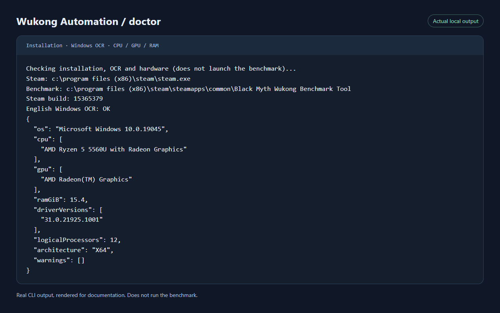
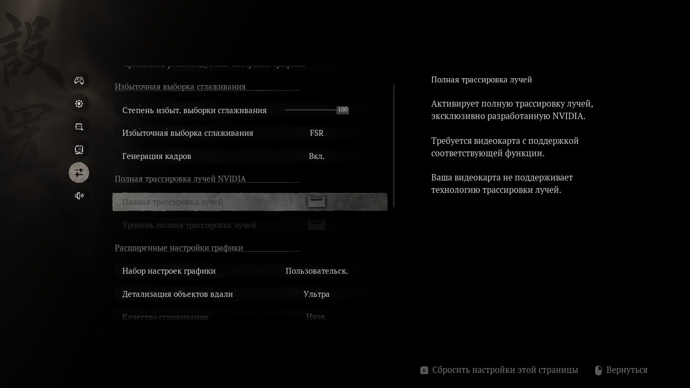

<p align="center">
  
</p>

<h1 align="center">Wukong Benchmark Automation</h1>

<p align="center">Два профиля производительности. Результаты самого бенчмарка. Один локальный отчёт.</p>

<p align="center">
  <a href="https://github.com/huksleva/wukong-benchmark-automation/actions/workflows/build.yml"></a>
  <a href="https://learn.microsoft.com/dotnet/csharp/"></a>
  <a href="https://dotnet.microsoft.com/download/dotnet/8.0"></a>
  <a href="https://github.com/charlesw/tesseract"></a>
  
  <a href="https://store.steampowered.com/app/3132990/Black_Myth_Wukong_Benchmark_Tool/"></a>
  <a href="LICENSE"></a>
</p>

<p align="center">
  <a href="#быстрый-старт">Быстрый старт</a> ·
  <a href="#демонстрация">Демонстрация</a> ·
  <a href="docs/USAGE.md">Руководство</a> ·
  <a href="docs/PROFILES.md">Методика</a> ·
  <a href="#github-actions">GitHub Actions</a> ·
  <a href="docs/VALIDATION.md">Статус проверки</a>
</p>

Утилита на C# запускает **Black Myth: Wukong Benchmark Tool** из Steam с CPU- и GPU-профилями, распознаёт итоговый экран через **Windows OCR** и локальный **Tesseract** для цифр и сохраняет FPS, оборудование и настройки в **HTML и JSON**.

> **Статус: проверка интеграции.** Сборка и автоматические проверки проходят; установленный Benchmark Tool, OCR и аппаратная диагностика проверены. Два полных автоматических прохода пока не подтверждены. [Подробности и критерии готовности →](docs/VALIDATION.md)

## Возможности

- Обнаружение Steam и установленного Benchmark Tool по AppID `3132990`.
- Последовательные CPU- и GPU-профили с проверкой выбранных значений в меню.
- Разбор среднего, минимального и максимального FPS; сохранение исходного изображения и OCR.
- Единый HTML/JSON-отчёт с CPU, GPU, RAM и подтверждёнными настройками.
- Резервное копирование INI, восстановление после штатного завершения и частичный отчёт при ошибке.

## Демонстрация

**Диагностика `doctor`.** Настоящий вывод команды с локального компьютера, оформленный в виде изображения для документации. Команда проверяет установку, OCR и оборудование, не запуская игру.



**Реальный интерфейс Benchmark Tool.** Кадр из локального автоматического запуска: меню графики и сообщение о неподдерживаемой трассировке на встроенном GPU. Это снимок самой программы; полный CPU/GPU-сценарий ещё проходит проверку.



Формат будущего итогового отчёта можно посмотреть в [примере JSON](docs/examples/report.json) и [HTML](docs/examples/report.html). В этих примерах используются отдельно помеченные синтетические данные; реальные FPS будут опубликованы после подтверждения двух проходов.

Цифры FPS дополнительно считываются локальным Tesseract. Модель включена в сборку; изображения не отправляются в облако. [Зависимости и лицензии →](THIRD_PARTY_NOTICES.md)

## Быстрый старт

Нужны Windows 10/11 **x64**, Steam и бесплатный [Benchmark Tool](https://store.steampowered.com/app/3132990/Black_Myth_Wukong_Benchmark_Tool/). Полная игра не требуется. Распознаются английские и русские подписи меню; для русского интерфейса нужен русский OCR Windows, для английского — English OCR.

**Готовая сборка:** [скачайте ZIP из успешного запуска Actions](#github-actions), распакуйте его полностью в доступную для записи папку и запустите **`Wukong.Automation.exe` двойным щелчком**. .NET уже включён; SDK, Git и Visual Studio для этого не нужны. Откроется мастер `start`: он проверит готовность и подскажет установку недостающих компонентов. Вход в Steam и первоначальные соглашения требуют вашего решения.

**Из исходников:** установите [.NET 8 SDK](https://dotnet.microsoft.com/download/dotnet/8.0) и Git, затем выполните:

```powershell
git clone https://github.com/huksleva/wukong-benchmark-automation.git
cd wukong-benchmark-automation
dotnet build src/Wukong.Automation/Wukong.Automation.csproj -c Release
dotnet run --project src/Wukong.Automation -c Release -- start
```

Перед `run` закройте Benchmark Tool и диалоги Steam. Во время проходов оставьте окно видимым и не используйте мышь/клавиатуру. При первом ручном запуске дождитесь компиляции шейдеров и пройдите первоначальные диалоги. `Ctrl+C` отменяет сценарий с попыткой восстановления INI.

| Команда | Назначение |
|---|---|
| `start` / запуск EXE без аргументов | Проверить готовность, помочь с установкой и выполнить оба профиля |
| `doctor` | Проверить установку, английский OCR и CPU/GPU/RAM |
| `run` | Выполнить оба профиля и записать отчёт |
| `parse --image result.png` | Разобрать сохранённое изображение результата |
| `parse --ocr result-ocr.json` | Разобрать ранее сохранённые OCR-данные |

Нестандартные пути, таймауты и подписи меню задаются через [runner.example.json](runner.example.json). [Полная инструкция и устранение ошибок →](docs/USAGE.md)

## Профили

Профили заданы заранее для воспроизводимости. По умолчанию программа не подбирает качество под желаемый FPS.

| Настройка | CPU-профиль | GPU-профиль |
|---|---|---|
| Выходное разрешение | 1280 × 720 | **1920 × 1080** |
| Пресет / набор настроек графики | Low / Низк. | Cinematic / Реалистичн. |
| Детализация объектов вдали | High / Выс. | Cinematic через пресет |
| Сглаживание, постобработка, тени, текстуры | Low через пресет | Cinematic через пресет |
| Эффекты, растительность, глобальное освещение, отражения | Low через пресет | Cinematic через пресет |
| Качество волос | Low через пресет | Cinematic через пресет |
| Размытие при движении | Off | Off |
| Метод избыточной выборки / Super Resolution Sampling | TSR | TSR |
| Масштаб рендера / степень избыточной выборки | 50% | 100% |
| Полная трассировка лучей | Off | Very High при поддержке; иначе явно отмеченный проход без RT |
| Генерация кадров | Off | Off |
| VSync / лимит FPS | Off / Off | Off / Off |

**Почему CPU-тест не в Full HD?** 720p и 50% рендера уменьшают обработку пикселей на GPU. High для дальности сохраняет больше объектов в сцене. GPU-профиль использует Full HD и максимальный пресет, чтобы повысить стоимость рендера. Размытие при движении отключено в обоих профилях для одинаковых условий постобработки. Генерация кадров отключена, чтобы измерять производительность без добавленных кадров; VSync и лимит FPS отключены, чтобы не ограничивать результат настройкой монитора.

Это выбор протокола проекта. При сравнении компьютеров используйте одинаковые разрешения, пресеты, режим RT и сборку Benchmark Tool. Изменённое разрешение или проход без RT нужно рассматривать как отдельный сценарий. Разрешение монитора можно запросить явно через `gpuWidth=null` и `gpuHeight=null`; оно больше не является значением по умолчанию.

Названия профилей выражают цель настроек. На слабой видеокарте CPU-проход тоже может быть ограничен GPU; текущая утилита не измеряет загрузку GPU и не доказывает изоляцию CPU. [Обоснование и границы методики →](docs/PROFILES.md)

### Нужно ли подбирать настройки под каждый компьютер?

В стандартном запуске — нет: программа применяет оба профиля сама. «Рекомендуемые настройки» самой игры предназначены для комфортной игры и не используются автоматизацией: они могут дать разное качество на разных компьютерах.

- **Сравнение компьютеров:** используйте одни и те же параметры каждого профиля. Изменение разрешения или режима RT создаёт отдельную серию результатов.
- **Исследование своего компьютера:** можно изменить разрешение GPU или отключить RT в конфигурации; выбранные условия будут видны в отчёте.
- **Слабый GPU:** низкие настройки CPU-профиля уменьшают работу видеокарты, но не превращают игровой пролёт в изолированный тест CPU. Программа сохраняет предупреждение об этом.

Разница CPU/GPU-профилей намеренная: они проверяют один и тот же пролёт с разной стоимостью графики. Их FPS нельзя трактовать как отдельные баллы процессора и видеокарты.

## Результаты

Каждый запуск создаёт `results/<дата-время-id>/` с `report.html`, `report.json`, журналом, резервными INI и изображениями обоих проходов. Парсер отклоняет неоднозначные значения и проверяет `min ≤ average ≤ max`. Показатель «95% FPS above» сохраняется отдельно и не является 1% low.

[Формат и состав артефактов →](docs/OUTPUT.md) · [Какие данные сохраняются →](DATA_HANDLING.md)

## Разработка

```powershell
dotnet run --project tests/Wukong.Tests -c Release
dotnet publish src/Wukong.Automation/Wukong.Automation.csproj -c Release -r win-x64 --self-contained true -o artifacts/runner
```

## GitHub Actions

[**Build and checks**](https://github.com/huksleva/wukong-benchmark-automation/actions/workflows/build.yml) — автоматическая проверка проекта. Она запускается при каждом push и открытии или обновлении pull request. Значок вверху README показывает состояние этой проверки для `main`.

На отдельной машине GitHub с Windows workflow:

1. Получает исходники и устанавливает .NET 8 SDK.
2. Собирает приложение в режиме Release.
3. Запускает автоматические проверки парсера FPS, INI, отчётов, конфигурации и распознавания стартовых экранов.
4. Публикует сборку Windows x64 со встроенным .NET и сохраняет её в артефакт **`wukong-runner-windows`**.

Чтобы скачать сборку, откройте **Actions → Build and checks → успешный запуск для нужного коммита → Artifacts → wukong-runner-windows**. Для скачивания артефактов войдите в GitHub. Распакуйте ZIP полностью и запустите `Wukong.Automation.exe` двойным щелчком: откроется мастер подготовки и запуска. **Устанавливать .NET отдельно не нужно.** В архиве есть `QUICKSTART.txt` и `build-info.json` с идентификатором исходного коммита. Артефакты хранятся 14 дней. Из PowerShell в распакованной папке также можно выполнить:

```powershell
.\Wukong.Automation.exe doctor
.\Wukong.Automation.exe start
```

Зелёный статус означает, что сборка и автоматические проверки прошли. **Actions не запускает Steam или Benchmark Tool и не измеряет FPS.** Проверка двух настоящих проходов выполняется локально и описана в [статусе проверки](docs/VALIDATION.md). Workflow находится в [.github/workflows/build.yml](.github/workflows/build.yml).


| Документ | Содержание |
|---|---|
| [Архитектура](docs/ARCHITECTURE.md) | Компоненты и последовательность обработки |
| [Contributing](CONTRIBUTING.md) | Как сообщить об ошибке и предложить изменение |
| [Security](SECURITY.md) | Приватное сообщение об уязвимости |
| [Code of conduct](CODE_OF_CONDUCT.md) | Правила общения в проекте |
| [Обработка данных](DATA_HANDLING.md) | Локальные артефакты и публикация отчётов |

## Лицензия

[MIT](LICENSE) · © 2026 Leonid Tots. Независимый проект; не связан с Game Science, Valve или VK. Названия сторонних продуктов принадлежат их владельцам.

Решение подготовлено с помощью ИИ-помощника Codex; статус реальной проверки указан отдельно.
