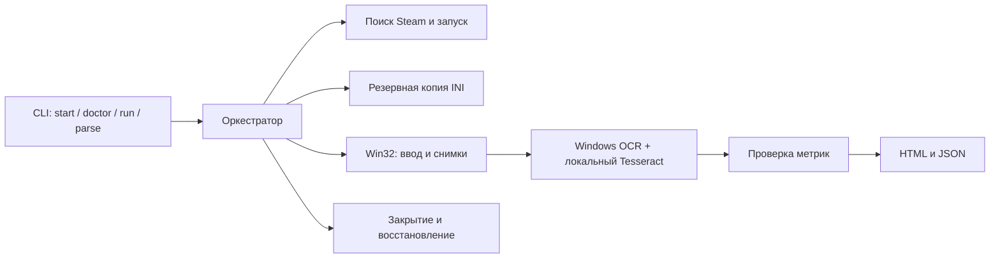

# Архитектура

[← README](../README.md)

| Компонент | Ответственность |
|---|---|
| `Wukong.Core` | Модели, проверка FPS, редактирование INI, формирование отчётов |
| `Wukong.Engine` | Переносимые профили, INI, распознавание состояний меню и сценарий прохода; `IBenchmarkWindow` / `IBenchmarkOcr` |
| `Wukong.Automation` | Windows CLI, Steam, Win32, Windows OCR / Tesseract, оборудование и оркестрация двух проходов |
| `Wukong.Reports` | Нативный переносимый CLI для чтения сохранённых отчётов и OCR JSON |
| `Wukong.Engine.Tests` | Проверки общего сценария с тестовыми оконным и OCR-адаптерами на всех ОС |
| `Wukong.Tests` | Проверки парсера, INI, конфигурации и экранирования HTML |
| `DocumentationPreview` | Воспроизводимый пример отчёта для документации |

Поиск установки использует реестр Steam, `libraryfolders.vdf` и манифест AppID `3132990`. Запуск выполняется через Steam. Ввод направляется в выбранное окно; снимки снимаются с видимой клиентской области, поэтому окно должно оставаться открытым и не перекрываться.

OCR работает локально через `Windows.Media.Ocr`; стилизованные цифры среднего FPS дополнительно распознаются Tesseract с двумя порогами контрастности. Модель и нативные библиотеки включены в сборку. Аппаратная информация получается штатным Windows PowerShell/CIM. Сторонние OCR-сервисы и Python для работы утилиты не нужны.

Настройки резервируются до первого прохода. Сценарий закрывает процессы своей установки перед восстановлением INI; ошибки и частичные результаты остаются в отдельной папке запуска. Эти меры не заменяют проверку актуального адаптера меню на настоящем Benchmark Tool.

## Формирование HTML

После каждого прохода и в финальном `finally` оркестратор вызывает `ReportWriter.Write(directory, SessionReport)`. `SessionReport` содержит статус, дату, оборудование, список CPU/GPU-проходов и ошибку при наличии. Поэтому при сбое сохраняется доступная часть результата.

[ReportWriter](../src/Wukong.Core/ReportWriter.cs) выполняет три действия:

1. Создаёт каталог через `Directory.CreateDirectory`.
2. Записывает `report.json` через `JsonSerializer.Serialize` и `File.WriteAllText`.
3. Вызывает приватный `Html(...)` и записывает `report.html` в UTF-8.

`Html(...)` собирает страницу через `StringBuilder`: встроенный CSS, таблицу FPS, оборудование, настройки, предупреждения и ссылки на исходные кадры/OCR. `WebUtility.HtmlEncode` экранирует текст и значения атрибутов; числа форматируются с `CultureInfo.InvariantCulture`. Скриншоты остаются соседними файлами с относительными ссылками. Для формирования страницы браузер, сервер, интернет или ИИ не нужны. Это отчёт измерений, а не автоматически сгенерированная документация к исходному коду.

Windows `ReportPresentation.Show(...)` отдельно выводит метрики и пути в консоль, затем пытается открыть HTML через обработчик по умолчанию. Ошибка открытия обрабатывается; сохранённый результат остаётся доступным. Нативный Reports выводит JSON/метрики в терминал и не запускает браузер.

## Разделение платформ

Общий сценарий использует `IBenchmarkWindow` для снимков, кликов, прокрутки и смысловых клавиш, а `IBenchmarkOcr` — для полного кадра, результата и области меню. Только Windows-адаптер преобразует смысловые клавиши в Win32 virtual-key codes. Перенос интерфейсов и успешные тесты движка не означают, что появился рабочий Linux/macOS игровой адаптер. [Следующий этап →](PORTING.md)
