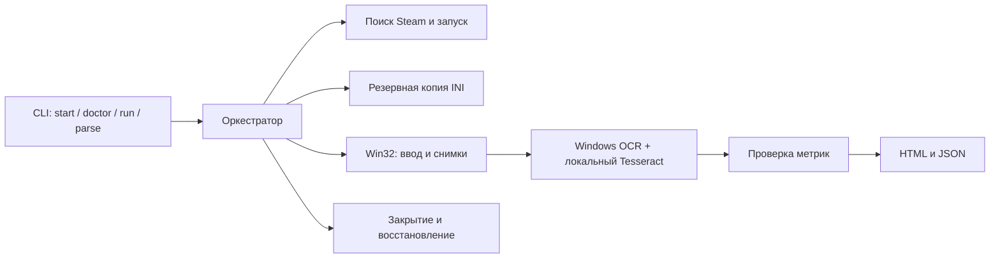

# Архитектура

[← README](../README.md)

| Компонент | Ответственность |
|---|---|
| `Wukong.Core` | Модели, проверка FPS, редактирование INI, формирование отчётов |
| `Wukong.Automation` | Обнаружение Steam, Win32, Windows OCR / Tesseract, профили и управление проходами |
| `Wukong.Tests` | Проверки парсера, INI, конфигурации и экранирования HTML |
| `DocumentationPreview` | Воспроизводимый пример отчёта для документации |

Поиск установки использует реестр Steam, `libraryfolders.vdf` и манифест AppID `3132990`. Запуск выполняется через Steam. Ввод направляется в выбранное окно; снимки снимаются с видимой клиентской области, поэтому окно должно оставаться открытым и не перекрываться.

OCR работает локально через `Windows.Media.Ocr`; стилизованные цифры среднего FPS дополнительно распознаются Tesseract с двумя порогами контрастности. Модель и нативные библиотеки включены в сборку. Аппаратная информация получается штатным Windows PowerShell/CIM. Сторонние OCR-сервисы и Python для работы утилиты не нужны.

Настройки резервируются до первого прохода. Сценарий закрывает процессы своей установки перед восстановлением INI; ошибки и частичные результаты остаются в отдельной папке запуска. Эти меры не заменяют проверку актуального адаптера меню на настоящем Benchmark Tool.
