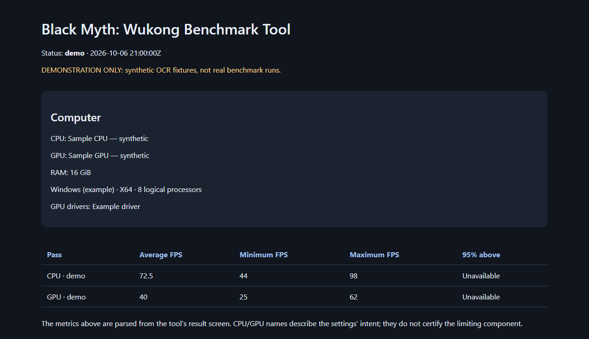

# Отчёты и артефакты

[← README](../README.md)

Каждый запуск создаёт отдельную папку `results/<дата-время-id>/`:

```text
report.html                читаемый отчёт: CPU/GPU/RAM, метрики, настройки
report.json                те же данные в машиночитаемом формате
runner.log                 журнал шагов и ошибок
run-config.json            запрошенные профили, пути, Steam build ID
backup/                    исходные INI и manifest.json с путём восстановления
cpu/ и gpu/
  result.png               исходный экран результатов
  result-ocr.json           распознанный текст с координатами
  effective-config/        INI после закрытия соответствующего прохода
  display-settings.*       подтверждение настроек экрана после Apply
  graphics-settings.*      подтверждение меню графики после Apply
  diagnostic-<номер>.*     последние 40 диагностических кадров и OCR
```

Обязательные метрики: средний, минимальный и максимальный FPS. Дополнительно считывается показатель «95% FPS above», если он доступен и однозначно распознан; это **не** 1% low. Утилита требует корректного порядка `min ≤ average ≤ max` и попадания дополнительного показателя между min и max, подтверждает числа на нескольких последовательных кадрах и возвращает ошибку при неоднозначном распознавании. Она не подменяет результаты внешним счётчиком FPS и не генерирует примерные значения.

Подписи итогового экрана уточняются Windows OCR по области сводки. Крупное число среднего FPS читается Tesseract с двумя вариантами контраста; чтения должны совпадать. Такие строки в OCR JSON помечены полем `source`, а исходный PNG сохраняется без изменений.

## Настоящий отчёт

[HTML](results/2026-10-08/report.html), [JSON](results/2026-10-08/report.json) и исходные экраны CPU/GPU опубликованы после единого успешного автоматического запуска. [Условия проверки →](VALIDATION.md)

## Пример для разработки

[Пример HTML](examples/report.html) и [пример JSON](examples/report.json) созданы штатным `ReportWriter` из синтетической OCR-фикстуры. Статус `demo`, модель оборудования и подписи явно обозначают демонстрацию. Эти файлы не подтверждают реальные проходы и не предназначены для сравнения оборудования.



## Перед публикацией

Локальные артефакты исключены из Git. В отчёте есть характеристики оборудования; в журнале, манифесте резервной копии и INI могут быть пути и идентификаторы. Перед размещением результатов прочитайте [описание обработки данных](../DATA_HANDLING.md).
